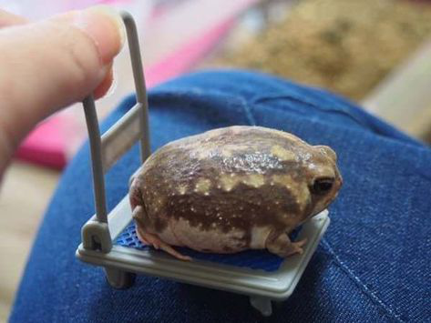
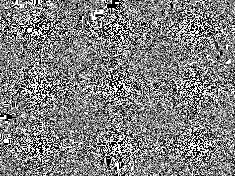

# Steganography Python Project


### Original Image // Encoded Image

These images may look identical, but one of them is encoded with a hidden message!

 


### Decoded Images


After running the encoded image through a short python script, this is the result!



And this is what happens when you try to decode the image that was never encoded with anything!

But how can the results be so different, if the two images look the same before going through the decoding function?

[Jump To Installation](https://github.com/AcidicNic/image_encoder#installation)

---

### How does this work?
Every png can be broken down into pixels and every pixel contains 3 numbers that can range from 0 to 255. So each pixel in a PNG file is represented by something that looks like this:

```(34, 0, 255)```

The first number represents red, the second is blue, and the third is green.

My script looks through the red value of every pixel and makes that value even or odd depending on what color that pixel should be in the encoded message.

So a pixel with an odd red value will show up as a black pixel when decoded, and an even red value will be white.

This only changes the color very slightly! (207, x, x) and (206, x, x) aren't noticeably different! And many pixels will be completely unaffected if they already happen to be odd or even.

### How could this be improved?
Using this strategy, you could even take it up a notch and use many more colors in the decoded image.

This process I explained above embeds a hidden binary digit into the red value of each pixel. This number will always either be a 1 or a 0. A binary number that is 1 digit long can only count up to 2, so you can only use 2 colors.

What if we hid a number in the green and blue values too? Then each pixel could hold 3 hidden binary digits, one in red, one in blue, and one in green! Then we could combine these 1s and 0s into a binary number which is 3 digits long.

These are all of the combinations we can make with 3 bits: `000 001 010 011 100 101 111`

These all represent 7 different numbers in binary, 0-6. So if we did this we could use a total of 7 different colors in the decoded image!

I'm not done yet, let's take it even further.

So what happens if instead of using 3 binary digits, we use 3 base-3 digits? This might sound kinda confusing so I'll quickly explain.

A binary digit is base-2 because each digit only has 2 possible states (0 or 1). Our regular number system is base-10 and each digit has 10 possible states (0-9). So a base-3 digit has 3 states (0,1,2).

Instead of making each color value odd or even, you divide it by 3 and check the "remainder" (which will always be either 0, 1, or 2) to determine which of your 3 colors you'd like to use for that pixel.

This would give you a total of 27 colors to work with!

We could keep going, but the higher we raise our base, the more the colors in the encoded image will actually change. Eventually, it will be noticeable.

And all of this is just if we wanted our encoded data to represent an image. It could be anything. With a 3 digit base-3 number encoded into every pixel inside of a 720p png (720x1280) we would have ~3.11 megabytes of encoded data! A 1080p image (1080x1920) encoded with base-3 digits could hold ~6.998 MB of hidden data.

Everything at it's core is stored in binary, 0s and 1s. Any number of any base can be converted into a binary number. So you really could encode anything into an image: another image, audio, text, etc. As long as you know how to take it apart and then put it back together the right way.

All this was just about one image. Now imagine what would happen if you encoded every pixel in every frame of a video.

The possibilities are endless!

---

### Installation

Clone this repo!
- ```git clone https://github.com/AcidicNic/image_encoder.git```

cd into the new directory
- ```cd image_encoder```

---

### How can I try using steganography.py?

Run the interactive menu and you wont have to worry about any of the other commands!
- ```python3 steganography.py```

Encode image "abc.png" with "hello world"
- ```python3 steganography.py abc.png hello world```

Decode image "abc.png"
- ```python3 steganography.py abc.png```

If you're too lazy to type .png, I've got you covered! And you should specify the directory if the image isn't in the same dir as the python script.
- ```python3 steganography.py /path/to/image/abc hello world```

Run the test which encodes and decodes images/chonker.png
- ```python3 steganography.py t```
- ```python3 steganography.py test```
